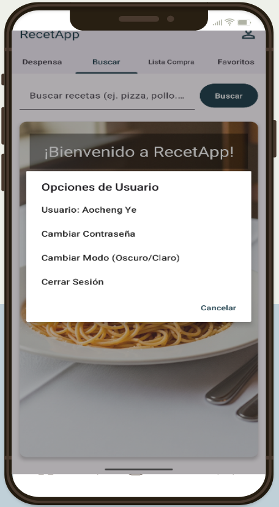
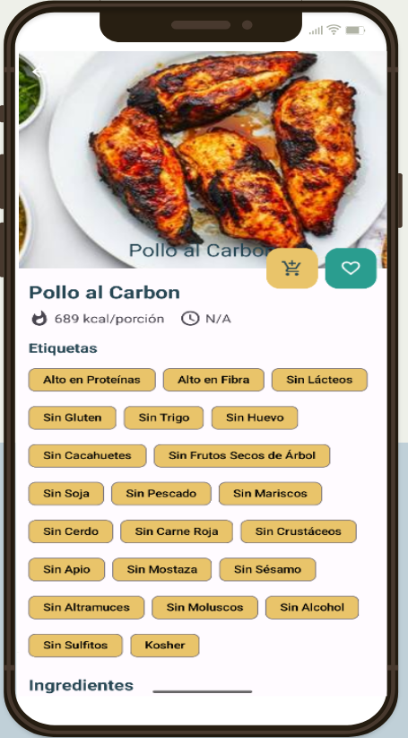
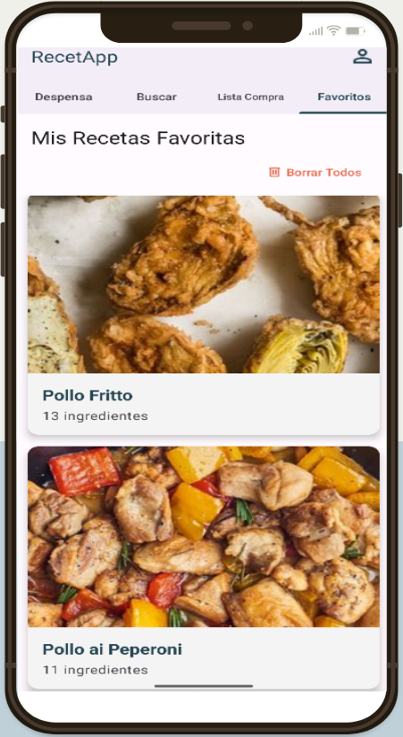
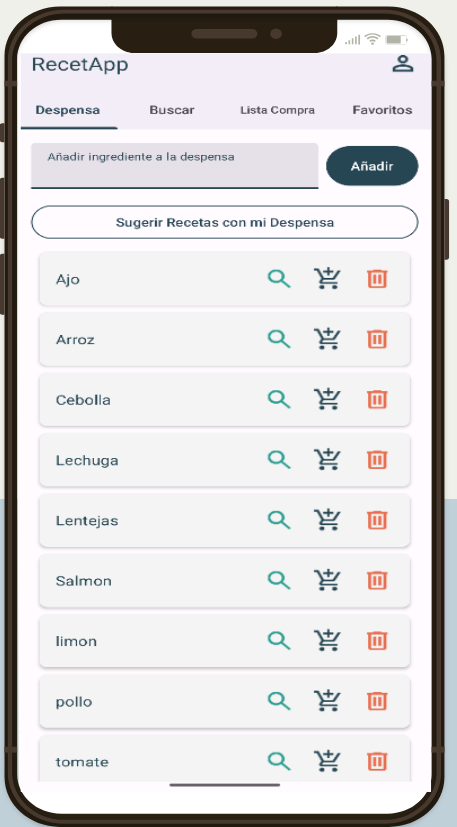

<h1 style="text-align: center; color: #333;">🍳 RecetApp 🍳</h1>

    Tu compañero ideal en la cocina: una <strong>aplicación Android nativa</strong>
    diseñada para simplificar la <strong>gestión de recetas</strong> y la <strong>planificación de comidas</strong>.
    ¡El <strong>proyecto final de mi ciclo DAM</strong>! 🚀

<h2 style="color: #007bff; border-bottom: 2px solid #007bff; padding-bottom: 5px;">📲 Funcionalidades Principales</h2>

<ul style="list-style-type: none; padding-left: 0;">
    <li style="margin-bottom: 1em;">
        <strong>&#10003; Acceso Fácil y Seguro:</strong> Inicia sesión con <strong>email/contraseña</strong> o tu <strong>cuenta de Google</strong>. ¡Recupera tu contraseña si la olvidas! 🔐
    </li>
    <li style="margin-bottom: 1em;">
        <strong>&#10003; Búsqueda Inteligente:</strong> Encuentra recetas por <strong>ingredientes o nombre</strong>. Combina términos para resultados más precisos. 🔍
    </li>
    <li style="margin-bottom: 1em;">
        <strong>&#10003; Detalles Completos:</strong> Accede a <strong>información nutricional</strong>, pasos, ingredientes (¡con <strong>traducción</strong>! 🗣️) y enlaces directos a la fuente original.
    </li>
    <li style="margin-bottom: 1em;">
        <strong>&#10003; Tus Favoritas a Mano:</strong> Guarda tus recetas preferidas en una sección exclusiva. ❤️
    </li>
    <li style="margin-bottom: 1em;">
        <strong>&#10003; Despensa Inteligente:</strong> Gestiona tus <strong>ingredientes disponibles</strong> y busca recetas directamente desde tu despensa. 🛒
    </li>
    <li style="margin-bottom: 1em;">
        <strong>&#10003; Lista de la Compra Pro:</strong> Crea listas, marca ítems y <strong>organiza los ingredientes por receta</strong>. 📝
    </li>
    <li style="margin-bottom: 1em;">
        <strong>&#10003; Personalización Total:</strong> Cambia entre <strong>tema claro y oscuro</strong>, y disfruta de <strong>animaciones fluidas</strong>. 🌙✨
    </li>
</ul>

<h2 style="color: #007bff; border-bottom: 2px solid #007bff; padding-bottom: 5px;">🧱 Tecnologías Utilizadas</h2>

<ul style="list-style-type: disc; padding-left: 20px;">
    <li style="margin-bottom: 0.5em;"><strong>Lenguaje:</strong> <strong>Kotlin</strong></li>
    <li style="margin-bottom: 0.5em;"><strong>IDE:</strong> <strong>Android Studio</strong></li>
    <li style="margin-bottom: 0.5em;"><strong>SDKs:</strong> Mínimo <strong>24 (Android 7.0)</strong>, Destino <strong>34 (Android 14)</strong></li>
    <li style="margin-bottom: 0.5em;"><strong>Android Jetpack:</strong> <strong>ViewModel, LiveData, RecyclerView, ViewPager2, ConstraintLayout</strong>, etc. <em style="color: #6c757d;">(Para una arquitectura moderna y robusta)</em></li>
    <li style="margin-bottom: 0.5em;"><strong>UI/UX:</strong> <strong>Material Components for Android</strong> (Material Design 3)</li>
    <li style="margin-bottom: 0.5em;"><strong>APIs de Red:</strong> <strong>Retrofit, Gson, OkHttp</strong> para la API de Edamam. 🌐</li>
    <li style="margin-bottom: 0.5em;"><strong>Carga de Imágenes:</strong> <strong>Coil</strong> (eficiente y fácil de usar) 🖼️</li>
    <li style="margin-bottom: 0.5em;"><strong>Backend como Servicio (BaaS):</strong> <strong>Firebase</strong> (<strong>Authentication, Cloud Firestore</strong>) para datos en la nube. 🔥</li>
    <li style="margin-bottom: 0.5em;"><strong>Inteligencia Artificial / Machine Learning:</strong> <strong>ML Kit Translate</strong> para traducción de ingredientes. 🗣️</li>
    <li style="margin-bottom: 0.5em;"><strong>Persistencia Local:</strong> <strong>SharedPreferences</strong> para preferencias de usuario.</li>
    <li style="margin-bottom: 0.5em;"><strong>Animaciones y Transiciones:</strong> XML, StateListAnimator para una experiencia fluida. 💫</li>
</ul>

<h2 style="color: #007bff; border-bottom: 2px solid #007bff; padding-bottom: 5px;">📸 Capturas de Pantalla</h2>

<table style="width: 100%; border-collapse: collapse; text-align: center;">
    <tr>
        <td style="padding: 10px; vertical-align: top; width: 33.33%;">
            <h3 style="color: #343a40; margin-bottom: 0.5em; font-size: 1.1em;">➡️ Inicio de Sesión</h3>
            
        </td>
        <td style="padding: 10px; vertical-align: top; width: 33.33%;">
            <h3 style="color: #343a40; margin-bottom: 0.5em; font-size: 1.1em;">➡️ Configuración</h3>
            
        </td>
        <td style="padding: 10px; vertical-align: top; width: 33.33%;">
            <h3 style="color: #343a40; margin-bottom: 0.5em; font-size: 1.1em;">➡️ Pantalla Principal</h3>
            
        </td>
    </tr>
    <tr>
        <td style="padding: 10px; vertical-align: top; width: 33.33%;">
            <h3 style="color: #343a40; margin-bottom: 0.5em; font-size: 1.1em;">➡️ Detalles de Receta</h3>
            
        </td>
        <td style="padding: 10px; vertical-align: top; width: 33.33%;">
            <h3 style="color: #343a40; margin-bottom: 0.5em; font-size: 1.1em;">➡️ Recetas Favoritas</h3>
            
        </td>
        <td style="padding: 10px; vertical-align: top; width: 33.33%;">
            <h3 style="color: #343a40; margin-bottom: 0.5em; font-size: 1.1em;">➡️ Lista de la Compra</h3>
            
        </td>
    </tr>
    <tr>
        <td colspan="3" style="padding: 10px; vertical-align: top;">
            
 
                <h3 style="color: #343a40; margin-bottom: 0.5em; font-size: 1.1em;">➡️ Despensa Personal</h3>
                
            

        </td>
    </tr>
</table>
